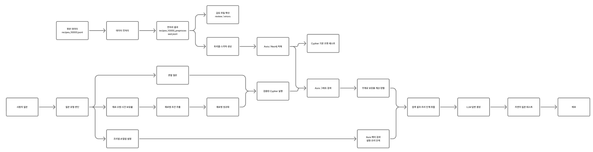

# 레시피 지식그래프

## 목차
1 기획 배경
2 프로젝트 개괄
3 서비스 소개
4 기술 스택
5 프로젝트 소감

 ## 1 기획배경
TV나 유튜브 등에서는 특정 요리를 위한 레시피를 알려주는 컨텐츠가 증가했으나, 막상 집에 있는 재료와 도구로 만들기에는 어려움. 이에 냉장고의 남은 재료로 간편하게 조리 가능한 레시피를 알려주어 실생활에 도움되는 레시피 추천 프로그램을 지식그래프를 이용하여 만들기로 했음.

## 2 프로젝트 개괄

### 2-1 팀명 및 팀원 역할

김유건: 데이터 수집 및 전처리
홍기표: 데이터 전처리, 스키마 설계
이승재(팀장): 스키마 제약조건 설정

### 2-2 GRAND RULE
30분마다 작업내용 상호 확인

과도한 AI 의존 지양

고난도 파트는 상호 질문을 통해 해결

이해 또는 코드 작성이 너무 힘들면 AI에게 질문

팀원에게 먼저 질문.

### 2-3 기간 및 기반 프로그램 등
프로젝트 기간: 2026년 9월 16일 ~ 9월 18일

기반프로그램: gpt-4o-mini, streamlit, Neo4j

대상데이터: 만개의 레시피의 레시피 10000개(조회수 기준)

### 2-4 프로젝트 개요

### 2-5 데이터 명세서
https://docs.google.com/spreadsheets/d/1WIwPYyMPBn8bh_Go8-OaQswg_GCBq-YrRnvJ5vugA3g/edit?usp=sharing

## 3 서비스 소개

### 3-1 

### 3-2 .... ....

## 4 기술스택

## 5 프로젝트 소감

