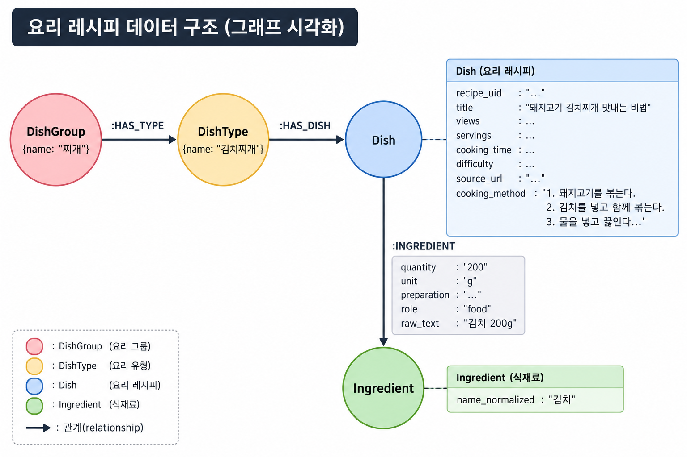
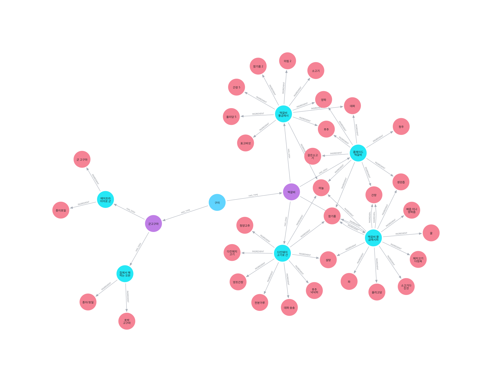
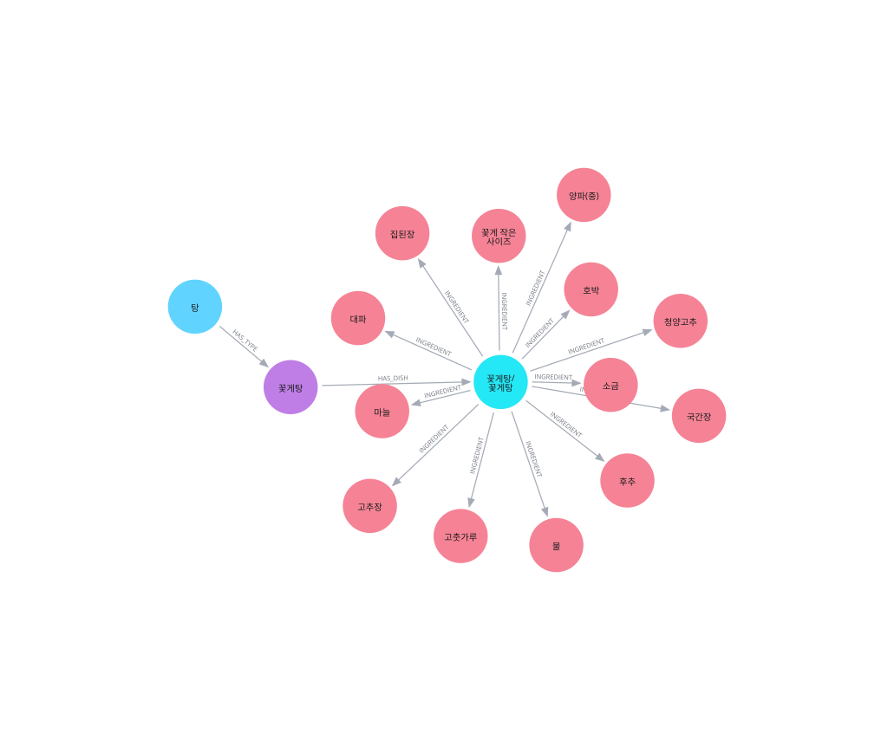
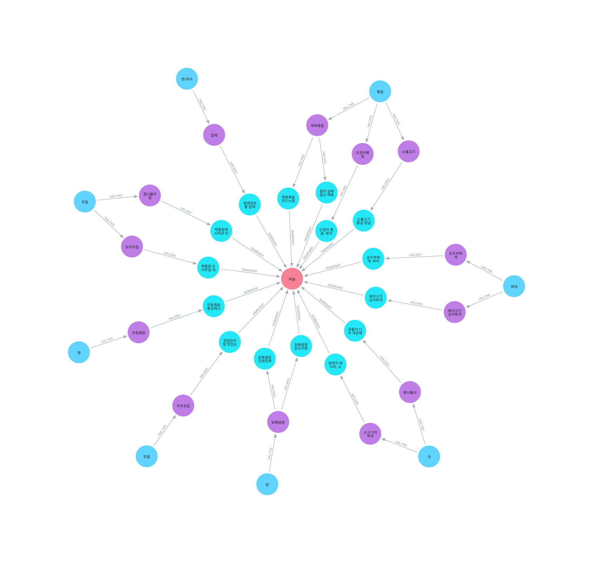
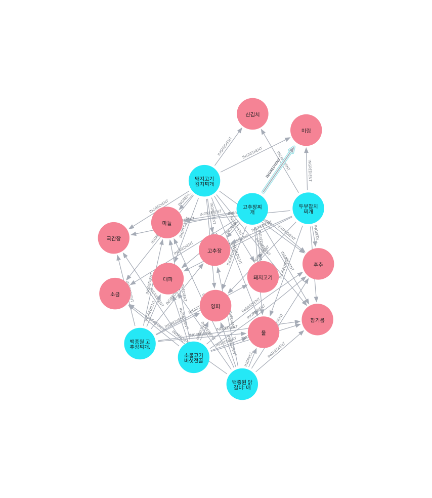

# 🍳 레시피 지식그래프 기반 요리 검색 서비스

Neo4j 지식그래프와 Streamlit을 활용한 레시피 검색 프로젝트입니다.
사용자는 음식명, 음식 분류, 포함할 재료, 제외할 재료를 기준으로 레시피를 검색하고 상세 조리 정보를 확인할 수 있습니다.

```text
Python · Neo4j · Cypher · Streamlit · Pandas
```

## 1. 프로젝트 소개

레시피를 단순한 문서 목록으로 저장하지 않고 음식 분류, 레시피, 재료 사이의 관계로 표현합니다.

현재 운영 중인 그래프 구조는 다음과 같습니다.

```text
DishGroup ──HAS_TYPE──> DishType ──HAS_DISH──> Dish ──INGREDIENT──> Ingredient
```

- `DishGroup`: 음식 대분류
- `DishType`: 음식 중분류
- `Dish`: 개별 레시피
- `Ingredient`: 정규화된 재료

현재 운영 코드에서 `Dish`는 개별 레시피를 의미하며 `recipe_uid`로 식별합니다.

## 2. 프로젝트 구조

```text
mle-01-p2-team2/
├─ app.py                         # Streamlit 실행 화면
├─ recipe_graph.py                # Neo4j 연결 및 Cypher 조회 함수
├─ data/
│  ├─ raw/                        # 원본 데이터
│  └─ processed/                  # 전처리·분류 완료 데이터
├─ image/                         # 그래프 시각화 이미지
├─ notebooks/                     # 수집·전처리·적재·임베딩 실험
├─ 기록 보관용/                    # 과거 스키마 및 벡터 검색 실험
├─ .env.example
├─ pyproject.toml
├─ uv.lock
├─ README.md                      # 기존 원본 README
└─ README_github.md               # GitHub 업로드용 통합 README
```

| 경로 | 역할 |
|---|---|
| `app.py` | Streamlit 레시피 검색·상세 정보·통계 화면 |
| `recipe_graph.py` | Neo4j 연결 및 Cypher 조회 함수 |
| `notebooks/10000clean.ipynb` | 레시피 데이터 정제 |
| `notebooks/대분류,중분류+neo4j 적재.ipynb` | 음식 분류 및 Neo4j 적재 |
| `notebooks/neo4j 적재.ipynb` | Neo4j 적재 작업 |
| `notebooks/백터임베딩.ipynb` | 임베딩 및 벡터 검색 실험 |
| `image/온톨로지.png` | 그래프 스키마 이미지 |
| `image/visualisation1.svg`~`visualisation4.svg` | 그래프 조회 예시 |

## 3. 데이터 수집 및 처리

데이터 출처는 [만개의레시피](https://www.10000recipe.com/)입니다.

| 항목 | 내용 |
|---|---|
| 원본 데이터 | `data/raw/recipes_10000.jsonl` |
| 최초 수집 건수 | 10,000건 |
| JSON 파싱 후 유효 데이터 | 9,997건 |
| 최종 정제 데이터 | 9,381건 |
| Neo4j 적재 대상 | 9,380건 |

### 전처리 항목

- 음식명 및 재료명 정규화
- 일반 재료와 양념 분리
- 수량·단위·범위 표현 정리
- 손질 방법 및 원문 재료 정보 보존
- 인분 및 조리 시간 추출
- 조리 단계 정렬 및 `cooking_method` 생성
- `graph_eligible` 기준으로 적재 가능 레코드 필터링

데이터 처리 흐름:

```text
data/raw/
    ↓
JSON 파싱 및 전처리
    ↓
data/processed/recipes_10000_cleaned.jsonl
    ↓
대분류·중분류 생성
    ↓
data/processed/recipes_classified_cleaned.jsonl
    ↓
Neo4j 지식그래프 구축
    ↓
Streamlit 검색 서비스
```

최종 분류 필터 조건:

```text
graph_eligible == True
title 값 존재
cooking_method 값 존재
ingredients_clean 값 존재
```

### 제거된 616건의 사유별 통계

`data/processed/recipes_10000_cleaned.jsonl` 9,997건과
`data/processed/recipes_classified_cleaned.jsonl` 9,381건을 `recipe_uid` 기준으로 비교해,
최종 분류 파일에 포함되지 않은 616건을 집계했습니다.

아래 표는 사유가 겹치지 않도록 대표 사유를 정해 분류한 결과입니다.

| 대표 제거 사유 | 건수 |
|---|---:|
| `graph_eligible=False`이며 재료·조리 과정이 없는 레코드 | 430 |
| 재료는 있으나 조리 과정(`cooking_method`)이 없는 레코드 | 137 |
| 조리 과정과 재료가 모두 없는 레코드 | 37 |
| 제목·재료·조리 과정이 모두 없고 `graph_eligible=False`인 레코드 | 12 |
| **합계** | **616** |

필드별 진단 건수는 조건이 중복될 수 있습니다.

| 진단 조건 | 건수 |
|---|---:|
| `cooking_method` 없음 | 616 |
| `ingredients_clean` 없음 | 479 |
| `graph_eligible=False` | 442 |
| `title` 없음 | 12 |

따라서 필드별 진단 건수를 단순히 더하면 616건을 초과합니다.

## 4. 대분류 및 중분류

대분류는 최종적으로 완성되는 음식의 형태를 기준으로 생성합니다.

```text
국, 찌개, 탕, 전골, 조림, 볶음, 구이, 찜,
튀김, 전/부침, 무침, 샐러드, 밥, 죽, 면/국수,
절임/장아찌, 소스/양념, 빵/베이킹, 디저트, 음료, 기타
```

예시:

```text
김치찌개   → 찌개
닭볶음탕   → 탕
갈비찜     → 찜
오징어볶음 → 볶음
미역국     → 국
```

중분류는 제목, 설명, 정제된 재료명, 조리 과정을 참고해 대표 음식명을 생성합니다.

```text
돼지고기 김치찌개 맛내는 비법 → 돼지고기김치찌개
엄마의 레시피, 소고기 미역국 → 소고기미역국
오징어 볶음, 백종원 오징어 볶음 → 오징어볶음
```

## 5. 데이터 구조

전처리 데이터는 다음과 같은 필드를 포함합니다.

```json
{
  "recipe_uid": "10000recipe_6912220",
  "source": "10000recipe",
  "source_id": "6912220",
  "source_url": "https://www.10000recipe.com/recipe/...",
  "title": "레시피 제목",
  "description": "레시피 설명",
  "servings": "2인분",
  "cooking_time": "30분 이내",
  "difficulty": "초급",
  "ingredients_clean": [],
  "seasonings_clean": [],
  "steps": [],
  "graph_eligible": true,
  "is_collection": false,
  "dish_group": "볶음",
  "dish_type": "제육볶음",
  "cooking_method": "1. ...\n2. ..."
}
```

## 6. 그래프 스키마

<p align="center">
  
</p>

```text
(DishGroup)-[:HAS_TYPE]->(DishType)-[:HAS_DISH]->(Dish)
(Dish)-[:INGREDIENT]->(Ingredient)
```

| 노드 | 식별 속성 | 주요 속성 |
|---|---|---|
| `DishGroup` | `name` | 음식 대분류명 |
| `DishType` | `key` | 대분류·중분류 복합 키, 이름 |
| `Dish` | `recipe_uid` | 제목, 조회수, 인분, 조리시간, 난이도, 출처 URL, 조리방법 |
| `Ingredient` | `name_normalized` | 정규화된 재료명 |

`DishType`는 중분류 이름만 사용하지 않고 다음과 같이 대분류와 조합합니다.

```text
dish_type_key = dish_group + "::" + dish_type
```

`INGREDIENT` 관계에는 다음 사용 정보가 저장됩니다.

```text
usage_key
quantity
unit
preparation
role
raw
amount_text
source_group
```

`role`은 일반 재료인 경우 `food`, 양념인 경우 `seasoning`으로 저장합니다.

### 관계 생성 방식 및 향후 확장

현재 `INGREDIENT` 관계는 LLM이 그래프를 직접 생성하는 방식이 아니라,
전처리 과정에서 만들어진 정형 필드를 Python으로 변환해 생성합니다.

| 대상 | 현재 방식 | 향후 확장 |
|---|---|---|
| `INGREDIENT` | `ingredients_clean`, `seasonings_clean`의 재료명·수량·단위·손질법을 관계 속성으로 변환 | 현재 정형 필드 기반 방식을 유지하고 중복·누락 검증 강화 |
| 조리법 | `steps`를 정렬해 `cooking_method` 문자열로 저장 | 설명·조리 과정에서 조리 행위와 순서를 LLM으로 추가 추출 |
| 조리도구 | 일부 전처리 데이터의 `tools_clean`에 보존되지만 현재 그래프 관계로는 적재하지 않음 | 비정형 텍스트에서 도구를 추출해 `USES_TOOL` 관계로 확장 |
| 대체 재료 | 현재 운영 그래프에는 별도 관계로 적재하지 않음 | 근거 문장과 함께 `SUBSTITUTE` 관계로 추출 |

LLM을 활용할 때도 원문에 없는 정보를 생성하지 않도록 다음 정보를 함께 보존합니다.

- 원문 근거 문장(`evidence`)
- 추출 대상 텍스트 위치
- 추출 방식(`structured` 또는 `llm`)
- 신뢰도 및 검토 상태

정형 필드는 Python으로 그대로 복사하고, LLM은 비정형 텍스트에서 후보와 근거를 추출하는 역할로 제한합니다.
추출 후에는 중복 관계, 근거 누락, 재료·도구명 정규화, 사람 검수 샘플링을 수행합니다.

## 7. Neo4j 적재 결과

| 항목 | 개수 |
|---|---:|
| `DishGroup` | 21 |
| `DishType` | 4,646 |
| `Dish` | 9,380 |
| `Ingredient` | 10,751 |
| `HAS_TYPE` | 4,646 |
| `HAS_DISH` | 9,380 |
| `INGREDIENT` | 90,129 |

적재 순서는 다음과 같습니다.

1. 고유 제약 조건 생성
2. `DishGroup` 노드 적재
3. `DishType` 노드 적재
4. 개별 레시피를 나타내는 `Dish` 노드 적재
5. `Ingredient` 노드 적재
6. `HAS_TYPE`, `HAS_DISH`, `INGREDIENT` 관계 적재
7. 예상 개수와 실제 개수 비교
8. 레시피별 분류·재료 연결 검증

주요 고유 제약 조건:

```text
Dish.recipe_uid UNIQUE
DishGroup.name UNIQUE
DishType.key UNIQUE
Ingredient.name_normalized UNIQUE
```

## 8. 임베딩 및 벡터 검색

임베딩 기능은 `notebooks/백터임베딩.ipynb`와 `기록 보관용/벡터 기반/`에 보관된 실험 기능입니다. 현재 기본 `app.py` 검색 화면에는 별도로 통합되어 있지 않습니다.

| 항목 | 설정 |
|---|---|
| 임베딩 모델 | `text-embedding-3-large` |
| 임베딩 차원 | 768 |
| 임베딩 문서 수 | 9,381 |
| 배치 크기 | 100 |

벡터 인덱스 예시:

```cypher
CREATE VECTOR INDEX dish_embedding_index IF NOT EXISTS
FOR (d:Dish) ON (d.embedding)
OPTIONS {
    indexConfig: {
        `vector.dimensions`: 768,
        `vector.similarity_function`: 'cosine'
    }
}
```

## 9. 그래프 시각화

<p align="center">
  
</p>

<p align="center">
  
</p>

<p align="center">
  
</p>

<p align="center">
  
</p>

### 시각화 재현용 Cypher 쿼리

아래 쿼리는 현재 운영 스키마 기준으로 각 시각화를 재현하기 위한 조회문입니다.

#### 1. 전체 계층 구조

```cypher
MATCH p=(g:DishGroup)-[:HAS_TYPE]->(t:DishType)
          -[:HAS_DISH]->(d:Dish)
          -[:INGREDIENT]->(i:Ingredient)
RETURN p
LIMIT 100;
```

#### 2. 특정 레시피의 분류와 재료

```cypher
MATCH p=(g:DishGroup)-[:HAS_TYPE]->(t:DishType)
          -[:HAS_DISH]->(d:Dish {recipe_uid: $recipe_uid})
          -[:INGREDIENT]->(i:Ingredient)
RETURN p;
```

예시 파라미터:

```cypher
:param recipe_uid => '10000recipe_6912220';
```

#### 3. 특정 재료를 사용하는 레시피

```cypher
MATCH p=(i:Ingredient {name_normalized: $ingredient})
          <-[:INGREDIENT]-(d:Dish)
          <-[:HAS_DISH]-(t:DishType)
          <-[:HAS_TYPE]-(g:DishGroup)
RETURN p
ORDER BY d.views DESC
LIMIT 100;
```

예시 파라미터:

```cypher
:param ingredient => '김치';
```

#### 4. 공통 재료 기반 레시피 추천

```cypher
MATCH (d1:Dish)-[:INGREDIENT]->(i:Ingredient)
      <-[:INGREDIENT]-(d2:Dish)
WHERE d1.recipe_uid < d2.recipe_uid
WITH d1, d2, collect(DISTINCT i.name_normalized) AS common_ingredients
WHERE size(common_ingredients) > 0
RETURN d1.title AS recipe_1,
       d2.title AS recipe_2,
       common_ingredients,
       size(common_ingredients) AS common_count
ORDER BY common_count DESC
LIMIT 50;
```

## 10. Streamlit 서비스 기능

### 요리 찾기

- 음식명 검색
- 대분류 선택
- 반드시 포함할 재료 입력
- 제외할 재료 입력
- 결과 개수 선택
- 레시피 제목, 분류, 음식명, 조리시간, 조회수 확인
- 재료·수량·단위·손질법·조리 순서 확인
- 원본 레시피 링크 이동

### 요리 통계

- 전체 노드 수
- 전체 관계 수
- 전체 레시피 수
- 전체 재료 수
- 대분류별 레시피 수
- 자주 등장하는 재료와 사용률

## 11. 실행 방법

### 의존성 설치

```bash
uv sync
```

### Neo4j 연결 설정

`.streamlit/secrets.toml.example`을 복사해 `.streamlit/secrets.toml`을 만들고 실제 접속 정보를 입력합니다.

```toml
NEO4J_URI = "neo4j+ssc://YOUR_INSTANCE.databases.neo4j.io"
NEO4J_USER = "YOUR_USER"
NEO4J_PASSWORD = "YOUR_PASSWORD"
NEO4J_DATABASE = "neo4j"
```

실제 비밀번호가 포함된 `secrets.toml`은 저장소에 커밋하지 않습니다.

### Streamlit 실행

```bash
python -m streamlit run app.py
```

## 12. 스키마 설계 변경 기록

`기록 보관용/`에는 v1부터 v3까지의 스키마 설계가 보관되어 있습니다.

### 버전별 구조

| 버전 | 구조 | 핵심 변경 |
|---|---|---|
| v1 | `Recipe → Component → Ingredient` | 재료 항목을 `Component` 노드로 관리 |
| v2 | `Recipe → Ingredient` | `Component`를 제거하고 `CONTAINS` 관계 속성으로 이동 |
| v3 | `DishGroup → DishType → Dish → Ingredient` | `Recipe` 노드를 제거하고 `Dish.recipes_json`에 레시피 저장 |

### v1에서 v2로 변경된 점

- `Component` 노드 제거
- 재료 사용 정보를 `CONTAINS` 관계 속성으로 이동
- `ALTERNATIVE` 관계를 `SUBSTITUTE` 관계로 변경
- 품질 검토 정보는 그래프 외부에서 관리

### v2에서 v3으로 변경된 점

- `Recipe` 노드 제거
- `DishGroup`, `DishType` 계층 추가
- 여러 레시피를 하나의 `Dish`에 통합
- 레시피 상세 정보는 `Dish.recipes_json`에 저장
- `CONTAINS`, `SUBSTITUTE` 관계에 `recipe_uid` 추가
- `VARIANT_OF` 관계 제거

### 현재 운영 코드와의 차이

현재 `app.py`와 `recipe_graph.py`는 다음 구조를 사용합니다.

```text
DishGroup → DishType → Dish → Ingredient
```

현재 운영 코드에서는 `Dish` 하나가 개별 레시피이며 `INGREDIENT` 관계를 사용합니다.

v3 최종 설계는 다음 구조를 목표로 합니다.

```text
DishGroup → DishType → Dish
                              └─ CONTAINS → Ingredient
                              └─ SUBSTITUTE → Ingredient
```

따라서 v3는 현재 운영 DB에 적용된 코드가 아니라 향후 적용을 검토 중인 설계안입니다.

## 13. 검증 및 주의사항

- 그래프 적재 기준 `Dish` 대상은 9,380건입니다.
- `recipes_classified_cleaned.jsonl` 9,381건과 Neo4j `Dish` 9,380건의 차이는 분류 누락 1건 때문입니다.
- 벡터 검색을 사용하려면 `Dish.embedding` 속성과 `dish_embedding_index`가 실제 Neo4j 인스턴스에 생성되어 있어야 합니다.
- Neo4j 접속 정보와 OpenAI API 키는 코드나 README에 직접 기록하지 않습니다.
- `.venv`, `__pycache__`, `.env`, `.streamlit/secrets.toml`은 저장소에 업로드하지 않습니다.

## 14. 개선 방향

- Streamlit 검색 화면과 벡터 추천 모듈 통합
- 자연어 질문을 Cypher로 변환하는 Text-to-Cypher 흐름 연결
- 재료 대체 관계를 실제 Neo4j 구조에 반영
- 전처리 제거 사유별 통계 추가
- 임베딩 및 벡터 인덱스 배포 자동화
- 레시피별 품질 점검 및 분류 누락 자동 보정
